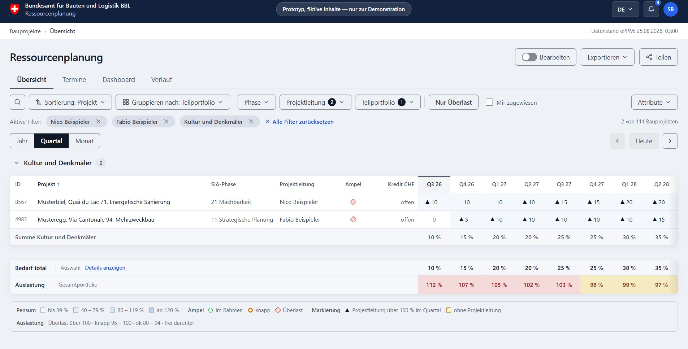
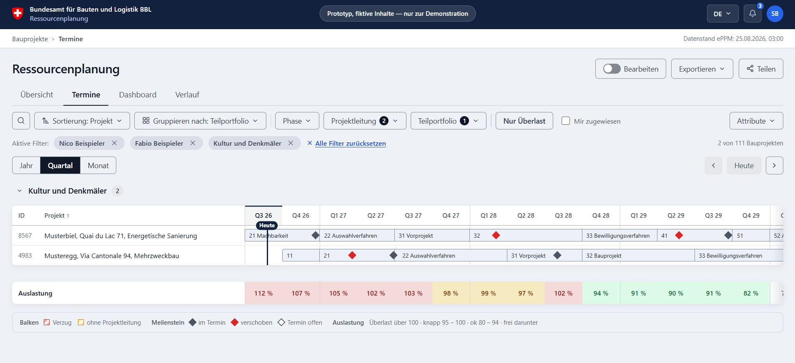

# BBL Resource Planning (Ressourcenplanung)

<p align="center">
  <a href="https://bbl-dres.github.io/resource/">
    
  </a>
</p>

[](https://bbl-dres.github.io/resource/)
[](LICENSE)


> [!CAUTION]
> **Unofficial prototype for demonstration purposes only.** All people, projects and operational data are fictional. The application is not intended for production use.

Resource-planning prototype for the [Federal Office for Buildings and Logistics (BBL)](https://www.bbl.admin.ch). It connects construction-project demand, schedules, milestones, project leads and team capacity in one portfolio view.

## Demo

**Live app:** https://bbl-dres.github.io/resource/

<p align="center">
  
  
</p>

## Highlights

- Portfolio overview, Gantt-style schedule, dashboards, change history and a read-only API reference.
- In-place demand editing, project-lead assignment and rebooking, with overload warnings and reasons.
- Filtering, grouping and sorting across year, quarter and month views in percent or FTE.
- Live calculation of demand, capacity, utilisation, free capacity and person-level workload.
- CSV, Excel and client-side PDF export; printable Overview and Schedule reports from A4 through A0.
- Responsive keyboard-accessible interface in German, French, Italian and English.

## Technical overview

- Static single-page application using vanilla JavaScript ES modules, HTML and layered CSS.
- No framework, package installation or build step; Swagger UI and Lucide assets are vendored locally.
- Fictional JSON fixtures for 111 projects, 46 people, eight quarters, 189 milestones and 249 history entries.
- Hash-based view state, escaped HTML templates and derived portfolio figures in `js/store.js`.
- OpenAPI 3.1 target contract with 20 paths and 42 operations; no live API is connected.

## Run locally

The app loads its JSON with `fetch()`, so serve the repository over HTTP instead of opening `index.html` directly:

```bash
python -m http.server 8000
# or
npx serve .
```

Then open <http://localhost:8000/>.

## Prototype limits

- Changes are stored only in browser memory and disappear on reload.
- The fixture model assigns each project to one lead; it does not yet support split person-level allocations.
- The planning horizon is fixed to eight quarters and the dense portfolio grids are designed primarily for laptop and desktop use.
- No automated test runner or CI workflow is committed; the review documents record manual and historical checks.

## Documentation

Design decisions and implementation reviews are collected in [`docs/`](docs/), including the latest [code review](docs/CODE-REVIEW-2.md), [design review](docs/DESIGN-REVIEW-3.md), [responsive review](docs/RESPONSIVE-REVIEW.md) and [print report](docs/PRINT-REPORTS.md).

## License

Original project code is licensed under the [MIT License](LICENSE). Lucide icons are ISC-licensed; vendored Swagger UI remains subject to its upstream terms.
